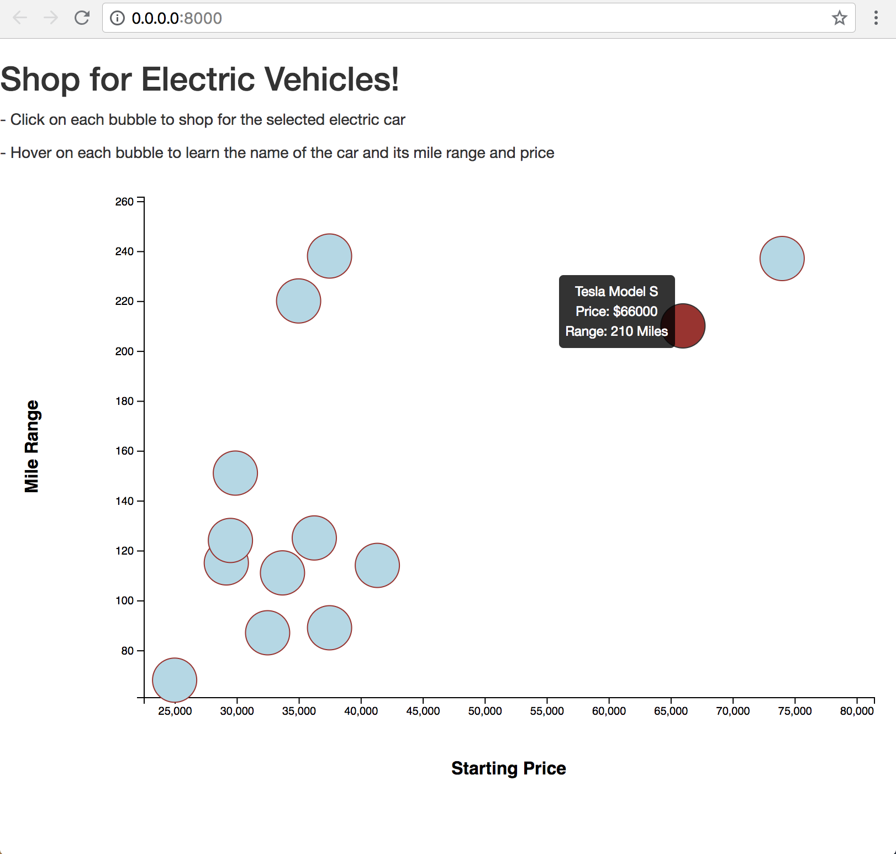

# VoltaBolt

Collaborated in a six person team to develop a website that helped consumers decide what electric car to purchase. As a team we identified the opportunity to create an all encompassing site that provided information on all current Electric Vehicles available in the US and where to purchase.

The team was broken up in Research and Development, Back End and Front End visualization. The team leveraged Beautiful Soup, JavaScript, and MongoDB. 

Visualization sample:

Leveraged D3 charting to create a visual aid for shoppers to make a comparison chart between:

	- Car model price
	
	- Mile range

This D3 visualization resizes based on the screen size of the user, and after the user hovers over the circle it will change color to show which bubbles the user has already explored. There is also a tooltip that appears when the user hovers over the bubble. Finally, each bubble is click-able and when clicked it will take the user to the homepage of each car where they can research further on where to purchase.

Final Team Presentation: https://docs.google.com/presentation/d/1yWrkf16IUOf0IauzldwxQbD3hpqM_8E77nWGdXcdy4k/edit#slide=id.p1
